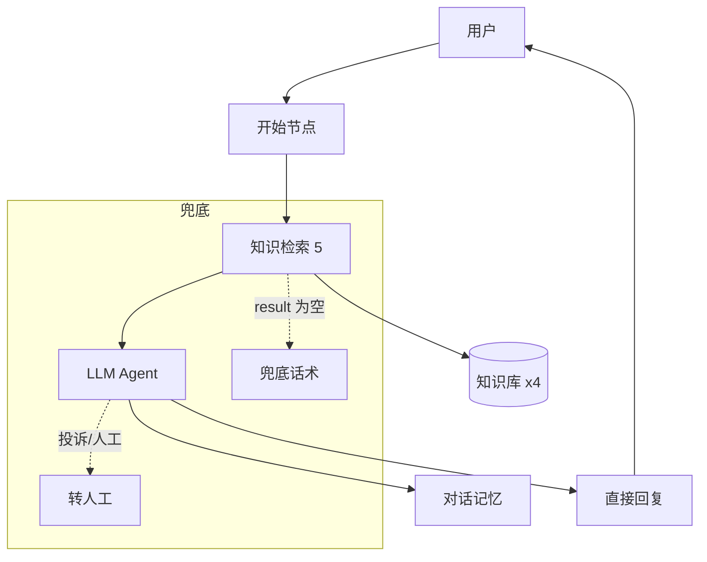

# 架构设计文档

## 1. 系统架构



## 2. Workflow vs Agent 演进

### V1：Workflow（四分支）

```
开始 → 问题分类器
  ├─ 产品信息 → 检索1 → LLM1 → 回复
  ├─ 使用售后 → 检索2 → LLM2 → 回复
  ├─ 订单查询 → 检索3 → LLM3 → 回复
  └─ 退款问题 → 检索4 → LLM4 → 回复
```

| 优点 | 缺点 |
|------|------|
| 分流精准、可控性强 | 4 套 Prompt 维护成本高 |
| 每类独立调优 | 多轮体验弱，难接上下文 |
| | 分类器额外消耗 token |

### V2：Agent Chatflow（当前）

```
开始 → 知识检索5（全库） → LLM5 → 直接回复5
```

| 优点 | 缺点 |
|------|------|
| 单 Prompt，易维护 | 检索噪音可能略高 |
| 多轮记忆自然 | 极端场景可控性略弱 |
| 更接近「智能体」体验 | 需更好兜底机制 |

**选型结论**：客服场景以 FAQ 为主，V2 性价比更高；订单/退款等强规则场景通过 Prompt 约束 + 转人工兜底。

## 3. RAG 流水线

| 阶段 | 配置 |
|------|------|
| 分段 | `##` 标识，500-800 字，重叠 50 |
| Embedding | BAAI/bge-m3 |
| 检索 | 混合检索，TopK=5，Score≥0.2 |
| 生成 | System 约束 + Context 注入 + 用户问题 |

## 4. Prompt 分层

| 层级 | 文件 | 作用 |
|------|------|------|
| 角色与规则 | prompts/system.md | 身份、原则、分类、安全 |
| 输入模板 | prompts/user.md | query + context |
| 兜底 | prompts/fallback.md | 检索为空 |
| 转人工 | prompts/handoff.md | 投诉/核实 |

## 5. 工具层（规划）

```
query_order(order_id) → Mock API → 订单状态 JSON
```

见 [tool-order-mock.md](tool-order-mock.md)

## 6. 数据流

1. 用户输入 `query`
2. 知识检索用 `query` 搜 4 库
3. TopK 片段注入 `context`
4. LLM 结合 `history` + `context` 生成回答
5. 输出引用来源（Dify 自动）
